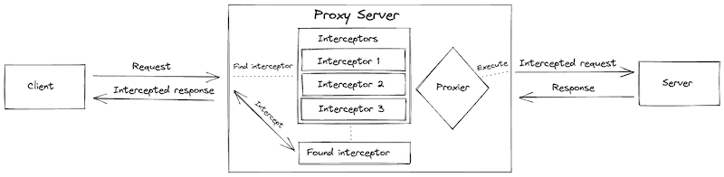
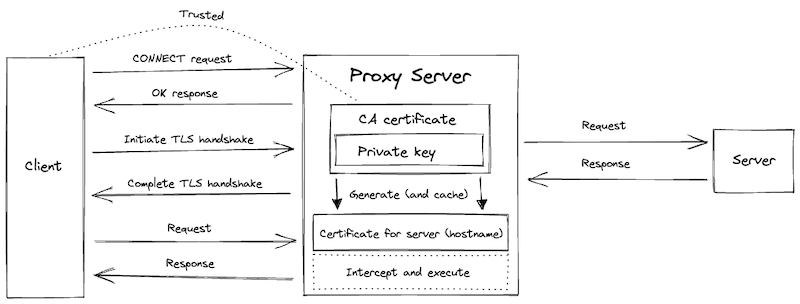

# proxi

[](https://github.com/c-fraser/proxi/actions)
[](https://github.com/c-fraser/proxi/releases)
[](https://search.maven.org/search?q=g:io.github.c-fraser%20AND%20a:proxi)
[](https://javadoc.io/doc/io.github.c-fraser/proxi)
[](https://www.apache.org/licenses/LICENSE-2.0)

`proxi` is an HTTP(S) 1.x proxy server which enables traffic to be intercepted and dynamically
transformed.

<!--- TOC -->

* [Usage](#usage)
* [Design](#design)
* [Examples](#examples)
  * [Intercept a proxied HTTP request](#intercept-a-proxied-http-request)
  * [Proxy an HTTPS request](#proxy-an-https-request)
    * [Proxy server provides trusted certificate chain](#proxy-server-provides-trusted-certificate-chain)
    * [Proxy server executes requests with mTLS](#proxy-server-executes-requests-with-mtls)
* [License](#license)
* [Acknowledgements](#acknowledgements)

<!--- END -->

## Usage

The `proxi` library is accessible
via [Maven Central](https://search.maven.org/search?q=g:io.github.c-fraser%20AND%20a:proxi).

## Design

The proxy `Server` proxies requests as displayed in the diagram below.



The first `Interceptor` matching the `Request` is used to `Interceptor.intercept` the `Request`
and `Response`.

> As such, be mindful of the `Interceptor` order in `Server.create`. `Interceptor` instances with
> more granular `Predicate<Request>` implementations should be nearer to the beginning of the
> provided array of `Interceptor`, otherwise they may be superseded by a more generic `Interceptor`.

The `Proxier` handles the execution of the proxy request. A `Proxier` implementation may be provided
when creating the `Server` to customize how proxy requests are executed.

To proxy HTTPS requests, the `Server` must be created with a CA certificate and (the corresponding)
private key. Additionally, the given CA certificate must be trusted by the (proxy) client(s). This
is necessary to be able to establish a TLS connection between the client and proxy `Server`, so
the `Server` can decrypt and intercept the `Request`. The TLS related interactions of proxying an
HTTPS request is depicted below.



## Examples

### Intercept a proxied HTTP request

<!--- TEST_NAME Example01Test --> 

<!--- INCLUDE
import io.github.cfraser.proxi.Interceptor
import io.github.cfraser.proxi.Request
import io.github.cfraser.proxi.Response
import io.github.cfraser.proxi.Server
import io.github.cfraser.proxi.ServerTest.Companion.PORT
import okhttp3.OkHttpClient
import okhttp3.ResponseBody
import okhttp3.mockwebserver.MockResponse
import okhttp3.mockwebserver.MockWebServer
import java.net.InetSocketAddress
import java.net.ProxySelector

fun runExample01() { 
----- SUFFIX 
}
-->

```kotlin
// Initialize a mock web server which is the target for proxy requests.
MockWebServer().use { target ->
  // Enqueue a mock response for the proxied request.
  target.enqueue(MockResponse().setBody("Hello!"))
  // Define a response interceptor to modify the proxy response.
  class ResponseInterceptor : Interceptor {
    override fun test(t: Request) = true
    override fun intercept(response: Response) {
      // Print the response from the proxy request.
      response.body?.let(::String)?.also { println("Intercepted: $it") }
      // Change the proxy response body.
      response.body = "Goodbye!".toByteArray()
    }
  }
  // Create and start a proxy server.
  Server.create(ResponseInterceptor()).start(PORT).use {
    // Initialize an HTTP client that uses the proxy server.
    val client =
      OkHttpClient.Builder().proxySelector(ProxySelector.of(InetSocketAddress(PORT))).build()
    // Execute a request then print the (intercepted) response body.
    client
      .newCall(okhttp3.Request.Builder().url(target.url("/hello")).build())
      .execute()
      .use { response -> response.body?.use(ResponseBody::string) }
      ?.also { println("Received: $it") }
  }
}
```

```text
Intercepted: Hello!
Received: Goodbye!
```

<!--- KNIT Example01.kt -->
<!--- TEST -->

### Proxy an HTTPS request

> The HTTPS examples use [okhttp-tls](https://github.com/square/okhttp/tree/master/okhttp-tls) to
> simplify the creation of certificates.

#### Proxy server provides trusted certificate chain

> This example code is intended to be representative of a realistic HTTPS deployment.

<!--- TEST_NAME Example02Test --> 

<!--- INCLUDE
import io.github.cfraser.proxi.Server
import io.github.cfraser.proxi.ServerTest.Companion.PORT
import io.github.cfraser.proxi.ServerTest.Companion.asFile
import okhttp3.OkHttpClient
import okhttp3.Request
import okhttp3.Response
import okhttp3.tls.HandshakeCertificates
import okhttp3.tls.HeldCertificate
import java.net.InetSocketAddress
import java.net.ProxySelector

fun runExample02() { 
----- SUFFIX 
}
-->

```kotlin
// Create a root certificate authority.
val rootCertificate = HeldCertificate.Builder().certificateAuthority(1).build()
// Create an intermediate certificate authority (signed by the root certificate).
val intermediateCertificate =
  HeldCertificate.Builder().certificateAuthority(0).signedBy(rootCertificate).build()
// Create a client certificates that trust the root certificate.
val clientCertificates =
  HandshakeCertificates.Builder().addTrustedCertificate(rootCertificate.certificate).build()
// Create and start a proxy server which uses the intermediate certificate authority to generate
// trusted certificates for the (destination of) proxy requests.
Server.create(
  // To proxy HTTPS requests the proxy server requires a CA certificate and private key.
  // The proxy client(s) must trust the provided CA certificate so the proxy server can generate a
  // (trusted) certificate to establish a TLS connection (to access the proxy request).
  certificatePath = intermediateCertificate.certificatePem().asFile("proxy.pem"),
  privateKeyPath = intermediateCertificate.privateKeyPkcs8Pem().asFile("proxy.key")
)
  .start(PORT)
  .use {
    // Initialize an HTTPS client that uses the proxy server and client certificates.
    val client =
      OkHttpClient.Builder()
        .proxySelector(ProxySelector.of(InetSocketAddress(PORT)))
        .sslSocketFactory(
          clientCertificates.sslSocketFactory(), clientCertificates.trustManager
        )
        .build()
    // Execute an HTTPS request and expect a successful response code.
    client
      .newCall(Request.Builder().url("https://httpbin.org/get").build())
      .execute()
      .use(Response::isSuccessful)
      .also(::println)
  }
```

<!--- KNIT Example02.kt -->
<!--- TEST
true
-->

#### Proxy server executes requests with mTLS

<!--- TEST_NAME Example03Test --> 

<!--- INCLUDE
import io.github.cfraser.proxi.Proxier
import io.github.cfraser.proxi.Server
import io.github.cfraser.proxi.ServerTest
import io.github.cfraser.proxi.ServerTest.Companion.LOCALHOST
import io.github.cfraser.proxi.ServerTest.Companion.PORT
import okhttp3.OkHttpClient
import okhttp3.Request
import okhttp3.Response
import okhttp3.mockwebserver.MockResponse
import okhttp3.mockwebserver.MockWebServer
import okhttp3.tls.HandshakeCertificates
import okhttp3.tls.HeldCertificate
import java.net.InetSocketAddress
import java.net.ProxySelector

fun runExample03() { 
----- SUFFIX 
}
-->

```kotlin
// Create a root certificate for the client and server to trust.
val rootCertificate = HeldCertificate.Builder().certificateAuthority(0).build()
// Create a server certificate (signed by the root certificate) for the mock web server.
val serverCertificate =
  HandshakeCertificates.Builder()
    .addTrustedCertificate(rootCertificate.certificate)
    .heldCertificate(
      HeldCertificate.Builder()
        .addSubjectAlternativeName(LOCALHOST)
        .signedBy(rootCertificate)
        .build()
    )
    .build()
// Create a client certificate (signed by the root certificate) for the client.
val clientCertificate =
  HandshakeCertificates.Builder()
    .addTrustedCertificate(rootCertificate.certificate)
    .heldCertificate(HeldCertificate.Builder().signedBy(rootCertificate).build())
    .build()
// Initialize an HTTPS mock web server which is the target for proxy requests.
MockWebServer()
  .apply { useHttps(serverCertificate.sslSocketFactory(), false) }
  .apply { requestClientAuth() }
  .use { target ->
    target.enqueue(MockResponse())
    // Create a proxier that uses the client certificates.
    val proxier =
      Proxier.create(
        OkHttpClient.Builder()
          .sslSocketFactory(
            clientCertificate.sslSocketFactory(), clientCertificate.trustManager
          )
          .build()
      )
    // Create and start the proxy server that can connect to the mock web server.
    Server.create(
      proxier = proxier,
      // Provide a certificate and private key to proxy HTTPS requests.
      certificatePath = ServerTest.PROXY_CERTIFICATE_PATH,
      privateKeyPath = ServerTest.PROXY_PRIVATE_KEY_PATH
    )
      .start(PORT)
      .use {
        // Initialize an HTTPS client that uses the proxy server and trusts its certificate.
        val client =
          OkHttpClient.Builder()
            .proxySelector(ProxySelector.of(InetSocketAddress(PORT)))
            .sslSocketFactory(
              ServerTest.PROXY_CLIENT_SOCKET_FACTORY,
              ServerTest.PROXY_CLIENT_TRUST_MANGER
            )
            .build()
        // Execute an HTTPS the request to the target and expect response to be successful.
        client
          .newCall(Request.Builder().url(target.url("/")).build())
          .execute()
          .use(Response::isSuccessful)
          .also(::println)
      }
  }
```

<!--- KNIT Example03.kt -->
<!--- TEST
true
-->

## License

    Copyright 2022 c-fraser
    
    Licensed under the Apache License, Version 2.0 (the "License");
    you may not use this file except in compliance with the License.
    You may obtain a copy of the License at
    
        https://www.apache.org/licenses/LICENSE-2.0
    
    Unless required by applicable law or agreed to in writing, software
    distributed under the License is distributed on an "AS IS" BASIS,
    WITHOUT WARRANTIES OR CONDITIONS OF ANY KIND, either express or implied.
    See the License for the specific language governing permissions and
    limitations under the License.

## Acknowledgements

Kudos to the [proxyee](https://github.com/monkeyWie/proxyee) project which significantly influenced
the implementation of `proxi`.
